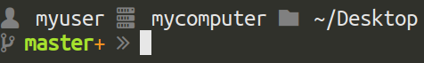

# doodleshell.zsh-theme

A custom `zsh` theme using [oh-my-zsh](https://ohmyz.sh/).

## Screenshots

The screenshots below were taken using `terminator` on Ubuntu. The font used is
`Ubuntu Mono Nerd Font Regular`.


### git

Prompt in a clean git repository:


A repository with unstaged changes:


A repository with staged changes:



### terraform

Prompt in a directory that contains a `.terraform-version` file:

> `.terraform-version` files are used by [tfenv](https://github.com/tfutils/tfenv),
> a terraform version manager.


### awscli

Prompt in a directory when the `$AWS_PROFILE` environment variable is set:


## Installation

Clone this repository, then copy the theme file into your [`oh-my-zsh`
installation](https://ohmyz.sh/#install):

```
git clone https://github.com/cdodd/doodleshell-zsh-theme.git
cp doodleshell-zsh-theme/doodleshell.zsh-theme ~/.oh-my-zsh/custom/themes/doodleshell.zsh-theme
```

Update the `ZSH_THEME` line in your `~/.zshrc` file:

```
ZSH_THEME="doodleshell"
```
